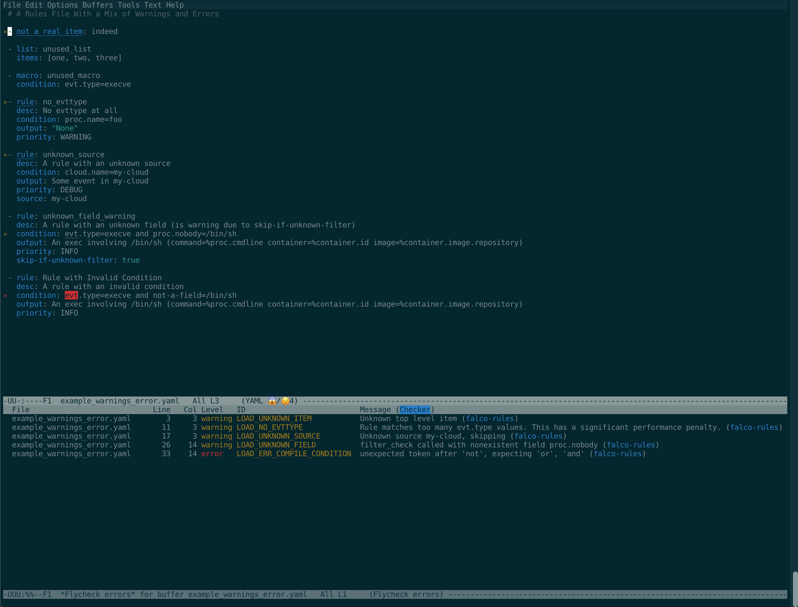

# flycheck-falco-rules - Flycheck for Falco rules files

A custom checker for Falco rules files that can be loaded using the [Flycheck](https://www.flycheck.org/) syntax checker for GNU Emacs.



## Setup

### Prerequsites

First, [install](https://www.flycheck.org/en/latest/user/installation.html) and [enable](https://www.flycheck.org/en/latest/user/quickstart.html) Flycheck if not already installed.

The default configuration for this integration relies on running Falco via [docker](https://falco.org/docs/getting-started/running/#docker).

### Installation Using MELPA

This checker is available on [MELPA](https://melpa.org/). Assuming you already have MELPA configured as a package source, it can be installed via:

```
M-x package-install RET flycheck-falco-rules RET
```

And then add the following to your `.emacs` file:

```
(with-eval-after-load 'flycheck
  (add-hook 'flycheck-mode-hook #'flycheck-falco-rules-setup))
```

### Manual Installation

1. Copy `flycheck-falco-rules.el` locally (for example, `~/elisp/flycheck-falco-rules.el`)
1. Add the following to your `.emacs` file:

```
(load "~/elisp/flycheck-falco-rules.el")
(with-eval-after-load 'flycheck
  (add-hook 'flycheck-mode-hook #'flycheck-falco-rules-setup))
```

## Configuration

If you wish to use a local instance of falco instead, you can override the `flycheck-falco-rules-validate-command` variable using the standard emacs [customization](https://ftp.gnu.org/old-gnu/Manuals/emacs-20.7/html_chapter/emacs_35.html#SEC436) feature. For example `M-x set-variable RET flycheck-falco-rules-validate-command RET falco -o json_output=True -V RET`

## License

Licensed under the Apache License, Version 2.0 (the "License");
you may not use this file except in compliance with the License.
You may obtain a copy of the License at

    http://www.apache.org/licenses/LICENSE-2.0

Unless required by applicable law or agreed to in writing, software
distributed under the License is distributed on an "AS IS" BASIS,
WITHOUT WARRANTIES OR CONDITIONS OF ANY KIND, either express or implied.
See the License for the specific language governing permissions and
limitations under the License.

See [COPYING](COPYING) for more details.
